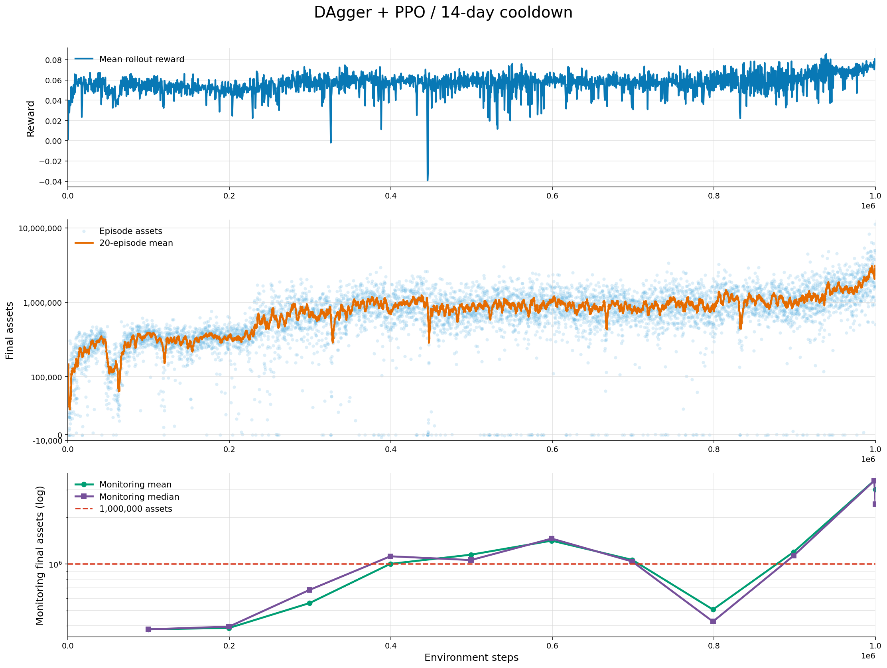
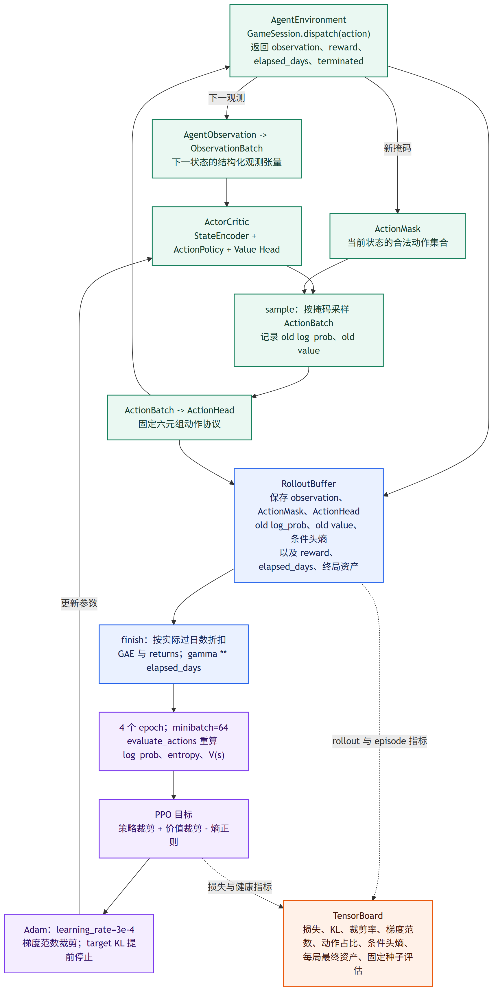

# TradeGame-RL

  > TradeGame是我以前捣鼓的一个小游戏，后来学习强化学习时，我重新利用了这个环境，在实际动手的过程中学习状态建模、动作设计和策略训练。现在的仓库则是在原有游戏基础上，借助 Codex 完成的一次系统重构。
------
TradeGame-RL 是一个以贸易经营为核心的回合制游戏，也是一个面向强化学习研究的可复现环境。玩家在多个城市之间采购和销售商品，规划陆运或海运路线，管理货车、库存、贷款和利息，并在 150 天挑战周期内扩大可清算资产。

项目中，游戏规则、状态和数值由 `trade_game.core` 统一维护；人类界面、智能体接口和 PyTorch 学习算法通过外围层接入同一套核心命令。这使得人类玩家与智能体面对完全一致的交易、运输、融资、车辆和市场规则。

项目包含三个可独立使用、也可相互验证的部分：

- 面向玩家的图形与终端经营游戏；
- 面向训练的动作协议、状态观测、动作掩码与环境接口；
- 基于 PyTorch 的事实矩阵编码、Actor-Critic、PPO、贪心基准、行为克隆和 DAgger 实现。

## 训练表现

第三版 DAgger + PPO 在 14 天城市-商品采购恢复期规则下完成约 100 万环境步训练。下图记录了 rollout 奖励、每局终局资产，以及固定训练集种子上的平均和中位数终局资产；最终模型在 16 个测试集种子上取得 2,044,307 平均终局资产和 1,996,818 中位数终局资产。



## 目录

- [训练表现](#训练表现)
- [快速开始](#快速开始)
- [项目结构](#项目结构)
- [游戏核心](#游戏核心)
- [人类游玩](#人类游玩)
- [智能体接口](#智能体接口)
- [状态观测与编码](#状态观测与编码)
- [Actor-Critic 网络](#actor-critic-网络)
- [奖励与 PPO](#奖励与-ppo)
- [学习与训练](#学习与训练)
- [相关文档](#相关文档)

## 快速开始

项目需要 Python 3.11 或更高版本。安装游戏、图形界面和训练依赖：

```powershell
python -m pip install -e ".[ui,learning]"
```

开始一局可复现的 150 天挑战：

```powershell
python -m trade_game play --seed 7 --mode challenge
```

使用终端界面游玩：

```powershell
python -m trade_game play --terminal --seed 7 --mode challenge
```

以默认配置验证 PPO 训练链路：

```powershell
python -m trade_game train --config trade_game/learning/configs/ppo_default.toml
```

## 项目结构

```text
trade_game/
├── core/                         游戏领域核心
│   ├── data/                     CSV/TOML 数值入口
│   ├── catalog.py                城市、商品、路线目录
│   ├── models.py                 游戏领域对象与状态
│   ├── commands.py               核心命令协议
│   ├── session.py                游戏会话与命令分发
│   ├── price_functions.py        价格函数
│   ├── trading.py                采购与销售
│   ├── transport.py              路线、运费、时长和货损
│   ├── finance.py                贷款、利息和还款
│   ├── vehicles.py               货车购买、维护和运力
│   ├── timeflow.py               日结、市场事件和库存变化
│   └── settlement.py              资产结算与终局判断
├── ui/                           人类游玩界面
│   ├── arcade/                   图形化货运调度台
│   ├── terminal.py               终端游玩界面
│   └── cli.py                    游玩命令入口
├── agent/                        智能体适配层
│   ├── actions.py                六元组动作协议与索引词表
│   ├── masks.py                  合法动作掩码
│   ├── observation.py            结构化状态观测
│   ├── decoder.py                ActionHead 与核心 Command 的双向转换
│   ├── environment.py            reset/step 训练环境
│   └── rewards.py                reward_v1
├── learning/                     原生 PyTorch 学习层
│   ├── batching.py               观测、掩码和动作的批处理
│   ├── encoder.py                事实矩阵与经营候选编码器
│   ├── policy.py                 条件动作策略与价值网络
│   ├── rollout.py                轨迹缓存和 GAE
│   ├── ppo.py                    PPO 采样与参数更新
│   ├── imitation.py              贪心教师、BC 和 DAgger
│   ├── evaluate.py               确定性策略评估
│   ├── tensorboard.py            TensorBoard 指标写入
│   ├── train.py                  训练配置和检查点
│   └── configs/                  PPO 与编码器 TOML 配置
└── analysis/                     离线数值与经济性分析
    └── greedy.py                 基于公开行情的经营基准
```

依赖关系如下：

```text
trade_game.core
├── trade_game.ui
├── trade_game.agent
│   └── trade_game.learning
└── trade_game.analysis
```

`GameSession.dispatch` 是游戏操作的统一入口。图形界面将玩家操作转换为 `Command`，智能体将六元组 `ActionHead` 解码为同样的 `Command`，随后由核心层执行规则并产生新的游戏状态。

## 游戏核心

### 数据与规则

静态实体数据位于 `trade_game/core/data/`：

| 文件 | 内容 |
|---|---|
| `cities.csv` | 城市名称、区域、运输方式、港口、银行和市场角色 |
| `products.csv` | 商品类别、基础进价、利润率、产地、保质期和价格波动参数 |
| `routes.csv` | 城市之间的陆运与海运路线及距离 |
| `rules.toml` | 初始资金、运力、利息、维护、市场事件和结算参数 |

CSV 提供城市、商品和路线等实体记录，TOML 提供游戏规则数值。目录加载器在启动时建立交叉引用，核心运行过程使用类型化的 `Catalog`、`Product`、`City`、`Route` 和 `GameRules`。

### 市场与价格函数

每个商品拥有基础采购价格、产地、静态利润率和动态价格参数。价格函数根据市场调整、商品利润率、目的城市消费属性、真实产地和运输距离计算当前采购价与销售价。

市场状态由长期商品趋势、城市局部价差和阶段性供需事件共同形成。趋势具有持续性，局部价差随时间平滑变化；短期事件表现为某类商品在一组城市中的稀缺或积压，并在事件周期内逐步生效和消退。历史报价由核心时间流维护，公开市场消息由当前市场事件生成。

### 交易、运输与经营

- 采购只能发生在商品声明的有效产地。
- 每个城市商品对拥有 14 天采购恢复期；恢复期间可以出售已有库存，但不能再次采购同一城市的同一商品。
- 异地销售结合商品利润率、目的城市需求和距离溢价。
- 陆运和海运拥有不同的路线、时长、运费和货损特征。
- 货物按真实产地和批次保存，并按 FIFO 顺序销售。
- 贷款产生逐日利息，货车产生逐日运营成本。
- 货车数量决定运输能力，车辆维护恢复可用状态。
- 每次跨越游戏日的操作都会执行利息、人工成本、商品老化、灭失和市场刷新。

## 人类游玩

图形界面以复古货运调度台为视觉形式，围绕玩家的经营循环组织为地图、交易、调度、车辆、融资和市场信息区域。地图显示城市所属区域和从当前位置可达的城市；交易界面分别提供采购和销售商品列表；调度界面展示目的地、运输方式、路线时长和费用；车辆与融资界面管理运力和资金。

图形操作统一提交核心命令，市场电报以简短的游戏内语言提示全局重要行情，例如商品稀缺、库存积压和预计持续时间。

## 智能体接口

### 动作协议

智能体输出固定六元组：

```text
(action_index, product_index, city_index,
 transport_index, quantity_index, fast_index)
```

`action_index` 的八个值直接对应核心操作：

| 索引 | 操作 | 使用参数 |
|---:|---|---|
| 0 | BUY | 商品、数量 |
| 1 | SELL | 商品、数量 |
| 2 | TRAVEL | 城市、运输方式、加急 |
| 3 | BORROW | 金额档位 |
| 4 | REPAY | 金额档位 |
| 5 | REPAIR_TRUCK | 无 |
| 6 | BUY_TRUCK | 数量档位 |
| 7 | NEXT_DAY | 无 |

商品、城市和运输方式的索引来自当前目录词表。数量头使用 21 个固定档位：

```text
1、5%、10%、15%、...、95%、100%
```

百分比档位相对于当前可执行上限解码为实际商品数量、贷款金额、还款金额或货车数量。动作解码器将动作头转换为 `Buy`、`Sell`、`Travel`、`Borrow`、`Repay`、`RepairTruck`、`BuyTruck` 或 `NextDay`。

### 动作掩码

动作掩码按照当前游戏状态提供可执行动作集合。策略先从八类核心操作中选择，再根据操作类型读取商品、城市、运输方式、数量和加急选项的条件掩码。掩码直接参与动作采样和轨迹动作概率计算，使策略输出与核心命令协议保持一致。

### AgentEnvironment

`AgentEnvironment` 提供训练算法需要的 `reset` 和 `step` 接口：

```python
from trade_game.agent import ActionHead, AgentEnvironment

environment = AgentEnvironment()
start = environment.reset(seed=7)
action = ActionHead(action_index=7)  # NEXT_DAY
transition = environment.step(action)
```

每次转移包含下一状态观测、下一动作掩码、奖励、实际经过天数、终局标记和资产统计。环境内部始终通过 `GameSession.dispatch` 执行动作。

## 状态观测与编码

Agent 观测由公开经营事实构成，并按其天然关系保留为矩阵：全局经营状态 `G`、当前位置标记 `X`、城市银行属性 `C`、商品特性 `P`、市场报价历史 `M`、路线与官方报价 `R`，以及库存批次 `L`。商品、城市和运输方式的目录索引只用于定位矩阵行，不作为神经网络数值输入。

市场行情使用城市 x 商品的公开参考售价矩阵；每个单元保留的历史点由训练配置定义。默认配置采样第 6、4、2 天前和当天：

```text
[city, product, D-6 / D-4 / D-2 / D]
```

金额相对于初始资金做对数缩放，比例、布尔值和进度保持线性数值。路线矩阵同时给出普通与加急运输的官方运费、时长、车辆耐久损耗和最短经济距离；库存矩阵保留商品、真实产地、数量、剩余保质期与 FIFO 次序。批处理阶段只为库存批次补齐，并用 `cargo_valid` 标记真实批次。

编码器先将事实行投影到统一的 64 维空间，再在网络内部组合采购候选 `[商品, 目的地, 运输方式]` 和库存候选 `[批次, 目的地, 运输方式]`。候选行按商品、城市和运输方案汇聚为动作条件向量，最后与全局经营状态融合为 128 维状态向量。利润、货损和售价溢价等经营结论不预先计算为特征。

| 参数 | 数值 |
|---|---:|
| `row_dim` | 64 |
| `state_dim` | 128 |
| `hidden_dim` | 128 |
| `dropout` | 0 |

完整结构说明见 [状态编码器文档](docs/architecture/state-encoder.md)。

## Actor-Critic 网络

Actor-Critic 共享状态编码器。策略网络直接比较商品、城市、运输方式与加急方案的候选向量，价值网络从 128 维全局状态向量输出 `V(s)`。

- 动作类型头输出 8 类核心操作。
- BUY 与 SELL 对商品候选评分，再选择数量档位。
- TRAVEL 依次选择目的城市、运输方式和普通或加急方案。
- BORROW、REPAY 和 BUY_TRUCK 根据全局状态与数量档位语义产生各自分布。
- REPAIR_TRUCK 与 NEXT_DAY 直接输出无参数命令。

采样得到的各条件头 log probability 按实际动作路径相加，形成六元组动作的联合 log probability。详见 [Actor-Critic 文档](docs/architecture/actor-critic.md)。

## 奖励与 PPO

### reward_v1

奖励以可清算经营资产的对数变化为密集信号：

```text
asset_log_change = log(assets_after) - log(assets_before)
```

可清算资产统一计入现金、库存变现价值、货车残值和债务。挑战周期结束时加入终局资产奖励，破产状态加入惩罚。该定义将借款视为资产负债表变化，使资金规模和真实经营收益保持区分。

### 原生 PyTorch PPO

PPO 训练循环由 `PPOTrainer`、`RolloutBuffer`、`StateEncoder` 和 `ActorCritic` 组成：

1. 环境按照当前策略采集固定长度轨迹。
2. 轨迹保存观测、动作掩码、六元组动作、采样策略 log probability、价值、奖励和经过天数。
3. GAE 根据实际经过天数使用 `gamma ** elapsed_days` 折扣。
4. 更新阶段重新计算同一批动作的联合 log probability、熵和价值。
5. PPO 同时使用策略裁剪、价值裁剪、熵正则、梯度裁剪和 KL 提前停止。
6. 训练集种子评估使用确定性条件策略，并记录最终资产、奖励和完整游玩轨迹。



详见 [PPO 训练流程文档](docs/architecture/ppo-training.md)。

## 学习与训练

两条训练路线共享同一个 `AgentEnvironment`、状态编码器、Actor-Critic 网络和动作协议。原生 PPO 从随机参数开始，通过环境奖励学习；贪心-DAgger-PPO 先利用贪心经营轨迹初始化策略，再使用 PPO 优化长期回报。

### 共同训练接口

每个决策步骤都经过同一条数据路径：

```text
AgentObservation + ActionMask
        -> ObservationBatch + ActionMaskBatch
        -> StateEncoder
        -> Actor-Critic
        -> 六元组 ActionHead
        -> GameSession.dispatch
        -> next observation, reward, elapsed_days
```

策略网络输出多个条件动作头，但只对当前动作路径计算概率。例如 `BUY` 只读取动作类型、商品和数量三个头；`TRAVEL` 读取动作类型、目的地、运输方式和加急四个头。每个头都先应用当前状态的动作掩码，再从合法类别中采样。当前路径上的各头 log probability 相加，得到整个六元组动作的联合 `log_prob`。

动作掩码限定智能体在当前状态下的合法类别，`GameSession.dispatch` 负责执行完整游戏规则。训练推理和人类游玩因此共享同一套核心命令约束。

### PPO 训练

#### Rollout 采样

PPO 训练器使用当前策略与游戏环境交互，固定收集一定数量的决策转移。每条转移保存：

- 结构化观测和对应的动作掩码；
- 六元组动作、旧策略联合 `log_prob` 和旧价值 `V(s_t)`；
- reward、是否终局、终局资产和实际经过天数。

采样阶段策略处于评估模式并使用 `torch.no_grad()`；轨迹进入 `RolloutBuffer` 后统一进行 GAE 和参数更新。并行环境分别推进独立的游戏回合。

#### 按游戏时间计算 GAE

一次 `TRAVEL` 可能经过数天，而一次交易操作通常只经过一天。因此折扣使用每个转移的 `elapsed_days_t`：

```text
gamma_t = gamma ** elapsed_days_t
delta_t = r_t + gamma_t * (1 - done_t) * V(s_{t+1}) - V(s_t)
A_t = delta_t + gamma_t * lambda * A_{t+1}
```

其中 `A_t` 是优势估计，`A_t` 与价值目标共同用于 PPO 更新。终局转移不 bootstrap 下一个状态；没有跨天的操作使用 `elapsed_days_t = 1`。

#### PPO 裁剪更新

更新阶段使用保存的旧策略概率与当前网络重新计算的概率构造比值：

```text
rho_t = exp(log_prob_new - log_prob_old)
L_policy = -mean(min(rho_t * A_t,
                     clip(rho_t, 1-epsilon, 1+epsilon) * A_t))
```

价值分支使用价值裁剪损失，策略熵作为正则项鼓励早期探索，最终目标为：

```text
L_total = L_policy + value_coefficient * L_value
          - entropy_coefficient * entropy
```

每个 minibatch 都会重新执行状态编码、动作掩码和联合动作概率计算，PPO 直接优化采样时使用的条件动作分布。更新过程使用梯度范数裁剪；近似 KL 超过当前目标时结束本轮 epoch，控制单次更新的策略变化幅度。

#### 训练调度与评估

训练配置可以指定环境数量、rollout 长度、PPO epoch、minibatch 大小、学习率、熵系数和 KL 目标。并行配置通常保持每轮总样本量稳定，例如 `8` 个环境各采集 `64` 步，得到 `512` 条转移。学习率、熵系数和 KL 目标可以从初始值平滑调度到最终值。

训练过程中使用固定的训练集种子周期性评估确定性策略；测试集种子用于训练结束后的完整回合评估。TensorBoard 记录训练过程指标，最终评估数据由 `evaluate_policy` 统一计算。

默认配置适合验证训练链路：

```powershell
python -m trade_game train --config trade_game/learning/configs/ppo_default.toml
```

覆盖更新次数、rollout 长度、checkpoint 和 TensorBoard 目录：

```powershell
python -m trade_game train `
  --config trade_game/learning/configs/ppo_default.toml `
  --updates 10 `
  --rollout-steps 512 `
  --checkpoint runs/ppo_quick/ppo.pt `
  --tensorboard-logdir runs/ppo_quick/tensorboard
```

### 贪心-DAgger-PPO 训练

这条路线依次经过贪心示范、BC 初始化、DAgger 状态聚合和 PPO 回报优化。前半段建立经营策略先验，后半段使用环境 reward 学习长期决策。

#### 贪心教师

`GreedyPolicy` 的输入是当前游戏状态和公开行情。它枚举商品、有效产地、销售目的地和运输方式，估算采购、运输、销售、运费、货损、占用天数和融资需求，选择当前可以完成的高价值经营计划。持有库存时，它比较本地出售与异地套现；资金不足时使用当前可用授信；新增货车依据边际运力收益与成本的关系决策。

教师依据当前公开行情生成核心 `Command`，再通过 `encode_command` 转换成六元组 `ActionHead`。教师标签与学生策略使用完全相同的动作空间和数量档位。

#### 行为克隆初始化

初始阶段在固定种子上运行贪心教师，保存不可变的三元组：

```text
(observation, action_mask, expert_action)
```

行为克隆把教师动作的联合负 log probability 作为监督损失，并使用同一动作掩码重新计算条件动作头。优化参数包括策略分支和共享状态编码器；价值分支在 PPO 阶段依据环境奖励学习。训练指标包括 BC loss、六元组动作一致率、动作类型一致率和梯度范数。

#### DAgger 状态纠偏

BC 数据来自教师访问的状态。DAgger 进一步让当前学生策略访问状态，并在每个访问状态上重新查询贪心教师：

```text
学生访问状态 -> 教师给出标签 -> 聚合到数据集 -> 重新 BC
```

收集轨迹时，`beta` 控制使用教师动作还是学生动作推进环境。配置从 `beta = 0.5` 逐步降到 `beta = 0`，学生访问的状态分布随训练逐步占据主导；每个状态的监督标签均来自教师。每轮 DAgger 结束后使用累计数据集重新进行若干轮 BC，并在固定种子上评估。

#### PPO 微调

DAgger 完成后，训练器复用已经初始化的 Actor-Critic 参数继续 PPO。PPO 阶段的优化目标由 `reward_v1`、GAE 和 PPO 裁剪目标组成，教师动作不参与 PPO 损失；策略变化由 PPO 的 KL 目标进行调节。教师信息通过初始化参数和聚合数据进入训练，最终策略由游戏长期回报塑造。

该流程的监测指标包括示范数据集规模、`beta`、学习者与教师动作一致率、BC 损失、PPO 指标和每轮评估结果。

DAgger、BC 与 PPO 将在后续入口重构中分别提供独立命令；历史组合配置不再作为当前默认用法。

### 贪心经营基准

贪心基准使用当前公开行情枚举采购、运输和套现计划，并在有可完成盈利计划时使用可用授信；新增货车必须能够覆盖剩余人工成本。它以当前信息计算经营计划，用于衡量经济规则下的可实现收益水平：

```powershell
python -m trade_game greedy --episodes 16 --start-seed 101
python -m trade_game greedy --seed 173 --trace
```

### 配置目录

当前训练只保留一个默认 PPO 配置，作为本阶段统一的起点：

| 配置 | 用途 | 采样方式 | 训练规模 |
|---|---|---|---:|---|
| `ppo_default.toml` | 统一默认 PPO 训练 | 由配置指定 | 由配置指定 |

历史实验配置已移至 `D:\Code\_待手动删除`，仅供人工查阅或恢复，不再属于当前仓库配置入口。

## 相关文档

- [四版训练方案与结果](docs/experiment_log.md)
- [智能体结构总览](docs/architecture/README.md)
- [状态编码器](docs/architecture/state-encoder.md)
- [Actor-Critic 网络](docs/architecture/actor-critic.md)
- [PPO 训练流程](docs/architecture/ppo-training.md)

## License

本项目使用仓库中的 [LICENSE](LICENSE) 所规定的许可证。
