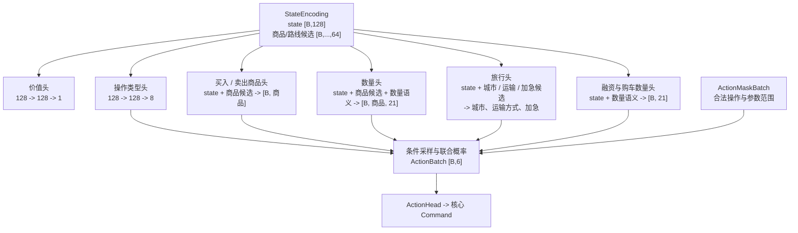

# Actor-Critic 条件动作网络

`ActorCritic` 共享一个 `StateEncoder`。编码器输出全局状态向量和按商品、城市、运输方案组织的候选向量；策略网络直接对这些候选行评分，价值网络只读取全局状态向量。



动作协议为：

```text
(action_index, product_index, city_index,
 transport_index, quantity_index, fast_index)
```

策略首先在八类核心操作中采样：买入、卖出、旅行、借款、还款、修车、购车和推进日期。随后只读取被选操作所需的条件头：

| 操作 | 条件路径 |
|---|---|
| `BUY` / `SELL` | 商品 -> 数量档位 |
| `TRAVEL` | 目的城市 -> 运输方式 -> 普通或加急 |
| `BORROW` / `REPAY` / `BUY_TRUCK` | 数量档位 |
| `REPAIR_TRUCK` / `NEXT_DAY` | 无附加参数 |

21 个数量档位以其公开含义输入数量头：一个单位，或可执行上限的 5% 到 100%。商品、城市和运输方式索引只选择候选行；数量档位没有可学习嵌入。

采样和 PPO 重放时，`ActionMaskBatch` 同时作用于操作类型及其条件头。当前动作路径经过的各头对数概率相加，得到完整六元组的联合 `log_prob`；熵也按同一路径计算。`ActionDecoder` 将采样结果转换为游戏核心的 `Command`，再由 `GameSession.dispatch` 执行。
