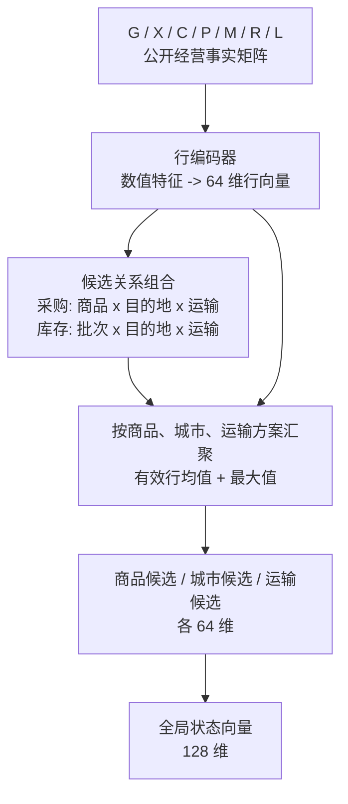

# 智能体状态编码器

`StateEncoder` 将游戏公开状态保留为有明确轴含义的事实矩阵，再在网络内部组合商品、城市、路线和库存关系。城市、商品和运输方式的目录索引只用于定位矩阵行，不作为数值特征或可学习的嵌入输入。

默认网络尺寸由训练配置指定：`row_dim = 64`、`state_dim = 128`、`hidden_dim = 128`。市场历史采样点由 TOML 的 `[observation].market_history_offsets` 定义；默认训练配置使用第 6、4、2 天前和当天。

## 观测矩阵

| 名称 | 形状 | 内容 |
|---|---|---|
| `G` | `[8]` | 经营进度、现金、债务、可用授信、车辆数、总运力、空余运力和车况 |
| `X` | `[城市]` | 当前所在城市的 one-hot 标记 |
| `C` | `[城市, 1]` | 城市是否提供银行服务 |
| `P` | `[商品, 6]` | 基础进货价、利润率、易腐属性、保质期、老化强度和运输损耗率 |
| `M` | `[城市, 商品, h + 2]` | 公开参考售价历史、产地采购资格和采购冷却进度 |
| `R` | `[起点, 终点, 运输方式, 6]` | 普通/加急官方运费与时长、车辆耐久损耗和最短经济距离；不可达路线另以布尔矩阵标记 |
| `L` | `[商品, 真实产地, 批次, 3]` | 当前库存的数量、剩余保质期与 FIFO 次序 |

货币数值以初始资金为尺度后使用 `log` 或 `log1p` 压缩；比例、布尔值、进度和天数比例保持线性数值。库存批次在组成批次时补齐，`cargo_valid` 仅标记真实批次。

## 编码过程

1. `G`、`C`、`P`、`M`、`R` 与 `L` 的每一行先通过独立 MLP 投影为 64 维向量。`X` 从城市行中选出当前位置，并与全局经营状态融合。
2. 采购候选将商品属性、当前市场、目标市场和从当前城市出发的路线组合为 `[商品, 目的地, 运输方式]` 行。网络据此形成每个商品和每个运输方案的采购上下文。
3. 库存候选以每个批次的商品和真实产地为轴，读取对应的目标市场和产地到目标地路线。它保留批次的保质期与 FIFO 信息，并形成商品和路线的库存上下文。
4. 市场、商品、路线与库存上下文分别沿其候选轴做有效行的均值/最大值汇聚；这些上下文再与全局经营状态融合为 128 维 `state`。

上述组合只使用游戏已经公开的报价、路线、库存和规则属性。售价距离溢价、预计货损、预计利润等经营结论不作为输入特征，而由候选关系和策略网络从原始事实中学习。

`StateEncoding` 同时输出 `state`、`product_tokens`、`route_city_tokens`、`route_mode_tokens` 和 `route_option_tokens`。策略头据此直接比较商品、目的地、运输方式和加急方案，无需将整个状态矩阵展平。
