# 四版训练方案与结果

TradeGame-RL 的训练实验围绕同一套游戏核心、智能体动作协议和状态编码展开，依次比较原始游戏规则下的两版 PPO、新游戏规则下的 PPO，以及贪心教师初始化的 DAgger + PPO。

## 评估口径

每局挑战模式持续 150 天。训练过程中使用训练集种子定期评估当前策略，并将终局资产和训练指标写入 TensorBoard。训练结束后使用测试集种子运行完整挑战回合，统计最终模型表现。

结果表统一报告四项指标：平均终局资产、中位数终局资产、终局资产达到 1,000,000 的回合数和破产率。训练集种子用于训练过程中的周期评估，测试集种子用于最终模型评估。

## 第一版训练方案（原始游戏规则）

### 训练方法

第一版使用原生 PyTorch PPO，从随机初始化的 Actor-Critic 开始训练。单个环境采集固定长度 rollout，策略通过结构化状态编码、条件动作头、动作掩码、GAE 和 PPO 裁剪目标学习经营决策。

每个转移保存观测、动作掩码、六元组动作、旧策略联合 log probability、状态价值、reward、经过天数和终局资产。GAE 根据实际经过天数使用 `gamma ** elapsed_days` 计算折扣。

### TensorBoard 训练监控

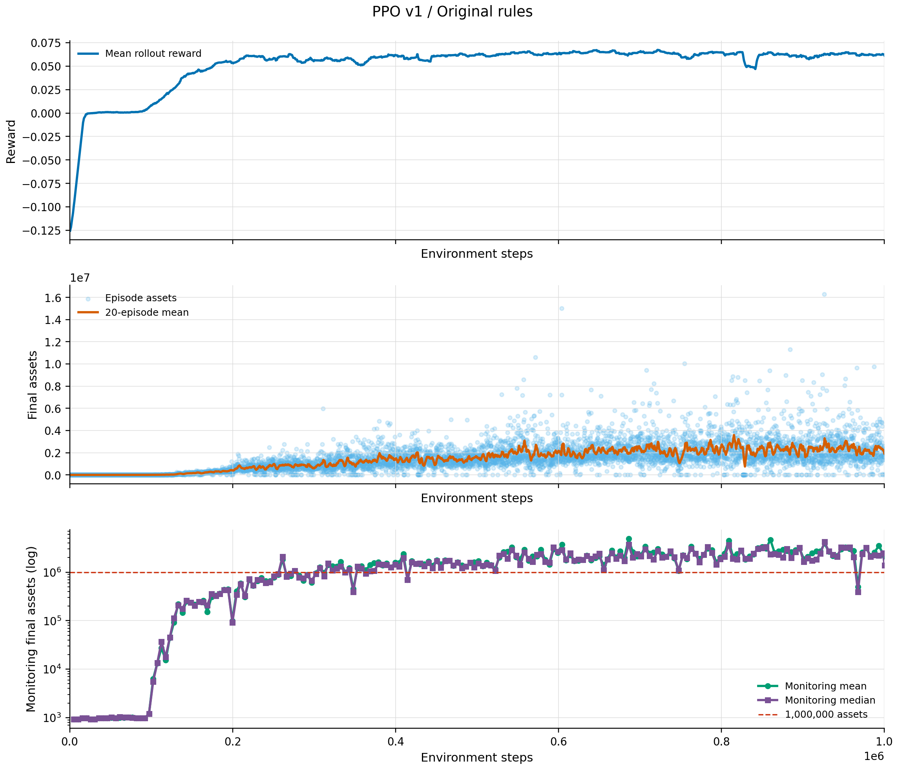

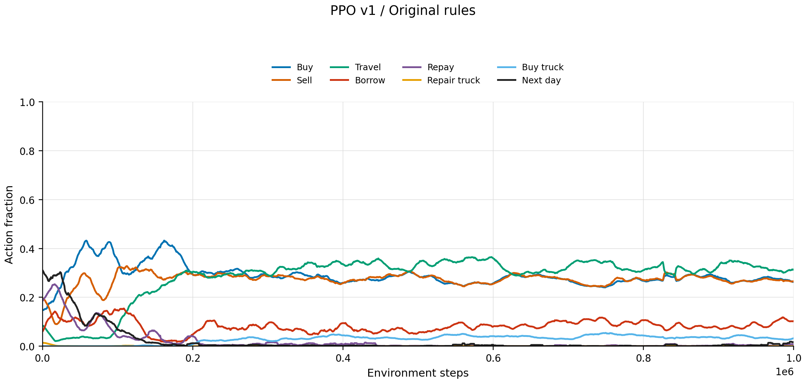

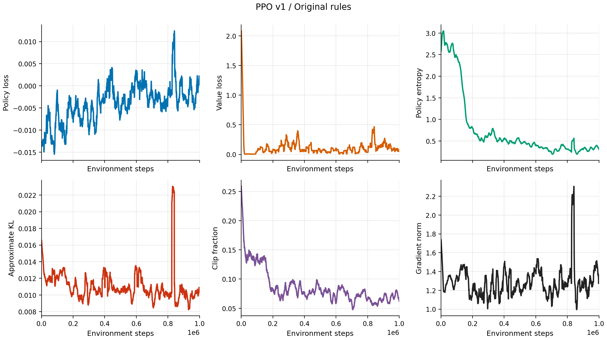

训练资产曲线从早期探索阶段的低位逐步上升，后期出现明显的跨种子波动。动作分布显示采购、出售和运输构成主要经营循环，借款与购车集中出现在资产扩张阶段。

### 模型评估

| 指标 | 训练集种子 | 测试集种子 |
|---|---:|---:|
| 平均终局资产 | 1,100,961.30 | 919,473.09 |
| 中位数终局资产 | 345,938.32 | 381,661.34 |
| 达到 1,000,000 | 6 / 16 | 4 / 16 |
| 破产率 | 0 | 0 |

第一版已经形成采购、运输、销售、融资和车辆扩容组成的经营闭环，但高收益局与低收益局之间差距较大。第一版高收益游玩轨迹见[第一版 PPO 游玩轨迹](ppo_v1_trajectory.md)。

## 第二版训练方案（原始游戏规则）

### 训练方法

第二版使用 8 个并行环境，每个环境采集 64 步 rollout，每轮更新处理 `8 x 64 = 512` 条转移。学习率、熵系数和 KL 目标随训练进度调度，PPO 仍使用第一版的动作协议、状态编码和 reward 定义。

### TensorBoard 训练监控

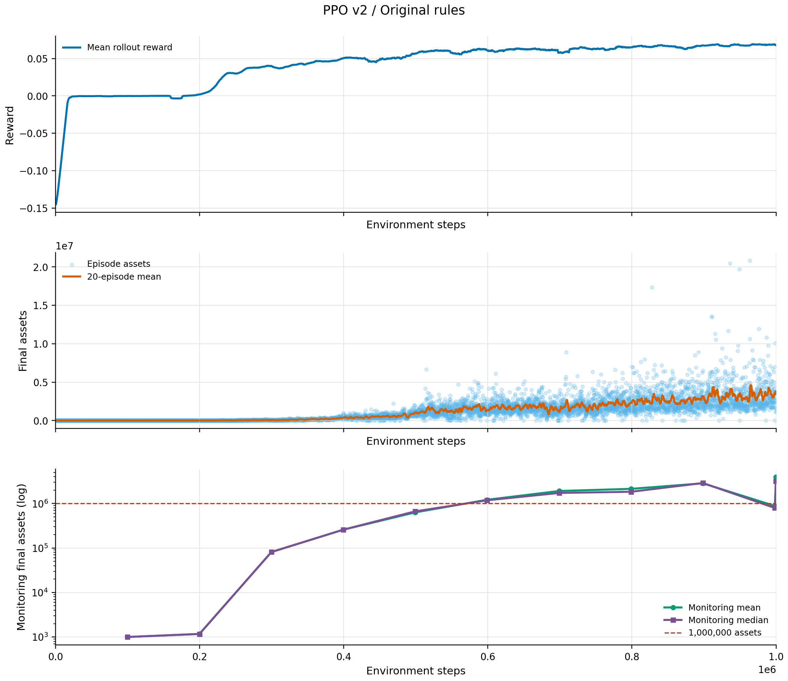

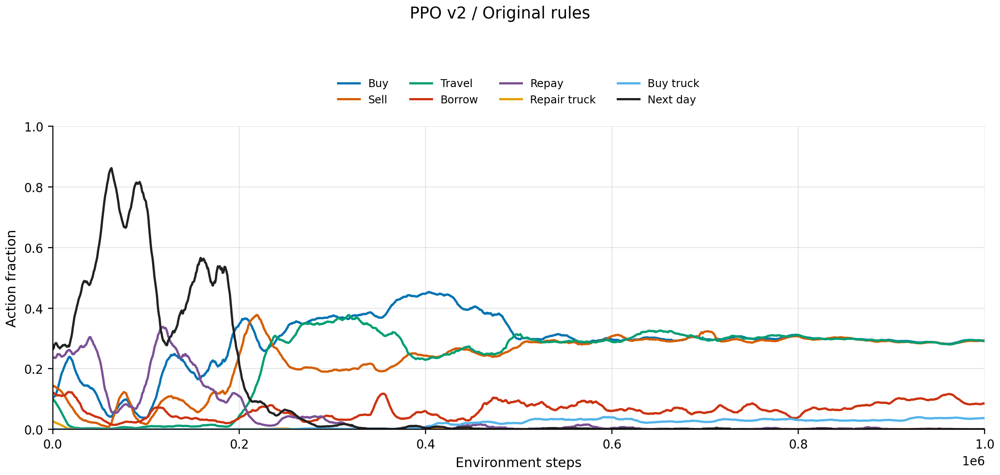

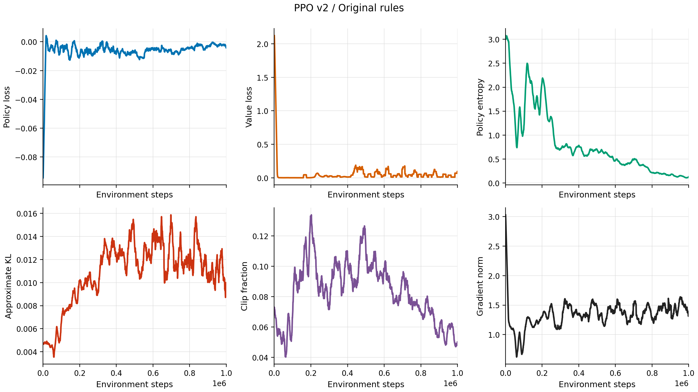

原始规则下第一版与第二版的训练期评估使用同一格式对齐展示：横轴为环境步数，纵轴为对数终局资产，虚线表示 1,000,000 资产水平。

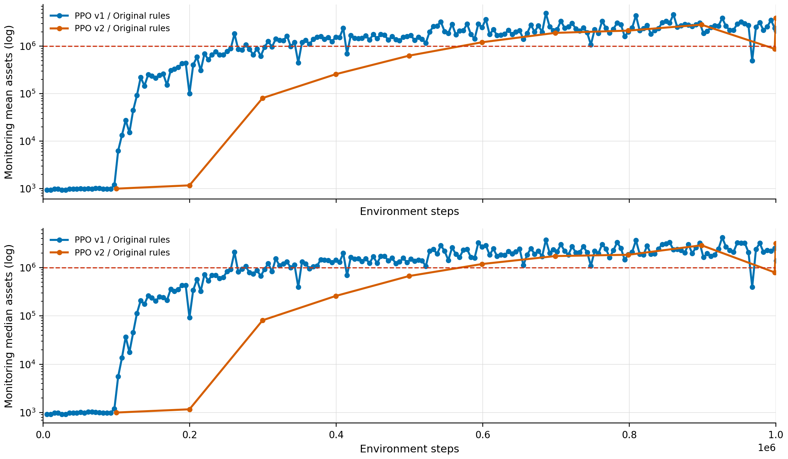

### 模型评估

| 指标 | 训练集种子 | 测试集种子 |
|---|---:|---:|
| 平均终局资产 | 3,944,993.29 | 3,544,279.33 |
| 中位数终局资产 | 3,173,483.79 | 3,107,480.12 |
| 达到 1,000,000 | 16 / 16 | 15 / 16 |
| 破产率 | 0 | 0 |

并行采样和渐进调度显著提高了资产增长速度与跨种子中位数。策略的经营路径仍集中在少数高价差城市和商品之间。第二版原始规则游玩轨迹见[第二版 PPO（原始游戏规则）游玩轨迹](ppo_v2_original_trajectory.md)。

### 原始游戏规则下的最终模型对比

| 训练方案 | 训练集种子平均终局资产 | 训练集种子中位数 | 测试集种子平均终局资产 | 测试集种子中位数 |
|---|---:|---:|---:|---:|
| 第一版 PPO | 1,100,961.30 | 345,938.32 | 919,473.09 | 381,661.34 |
| 第二版 PPO | 3,944,993.29 | 3,173,483.79 | 3,544,279.33 | 3,107,480.12 |

## 游戏平衡性更新

原始规则允许同一城市的同一商品在短周期内重复采购，固定路线可以持续放大采购、运输和融资规模。游戏更新为城市-商品采购对增加 14 天恢复期：

```text
完成采购
    -> 写入城市-商品恢复时间
    -> 恢复期内关闭同一采购动作
    -> 已有库存继续销售
    -> 恢复后重新开放采购
```

恢复期同步进入核心状态、价格函数、Agent 观测、动作掩码和人类界面，交易命令与人类操作使用同一规则。

## 第二版训练方案（新游戏规则）

### 训练方法

第二版训练方案在 14 天城市-商品采购恢复期这一新游戏规则下重新训练。采样规模、PPO 更新方式以及学习率、熵系数和 KL 目标调度沿用原始游戏规则的第二版配置。

### TensorBoard 训练监控

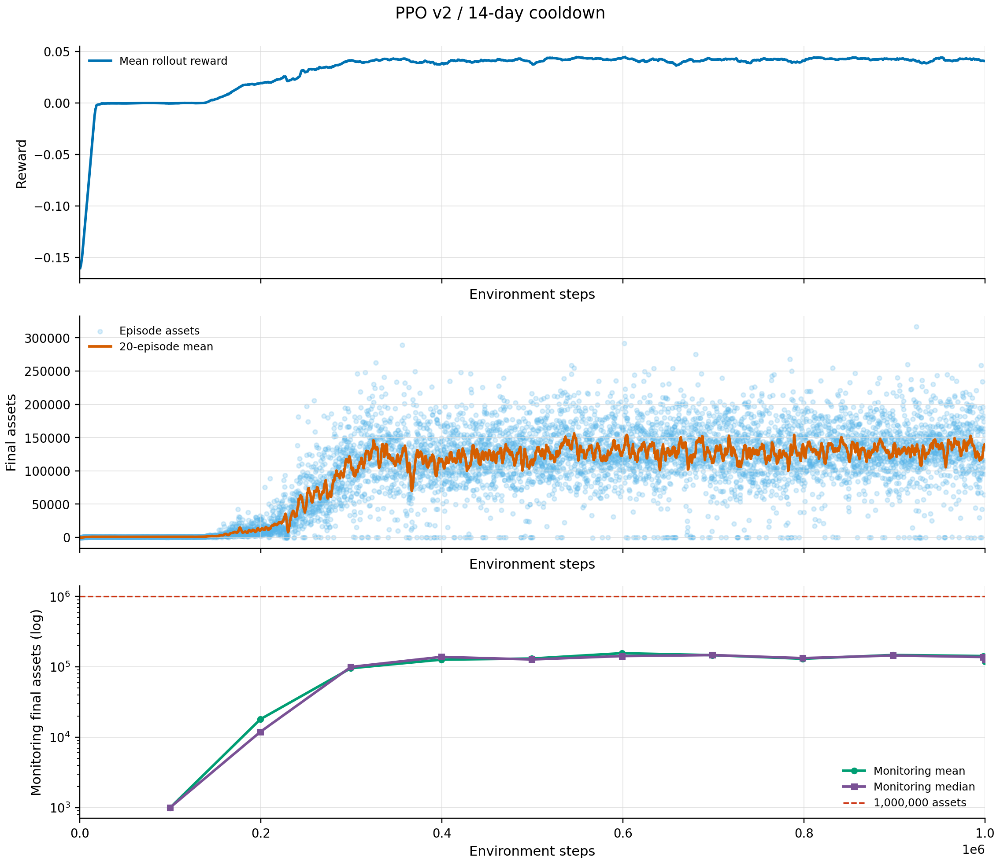

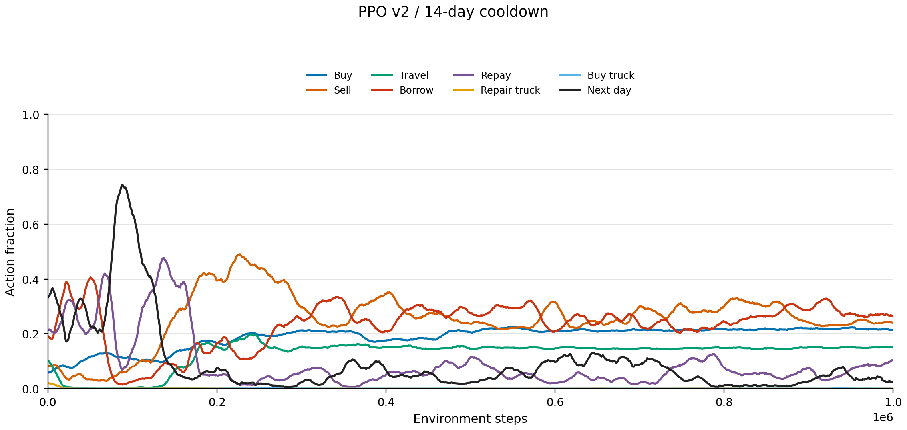

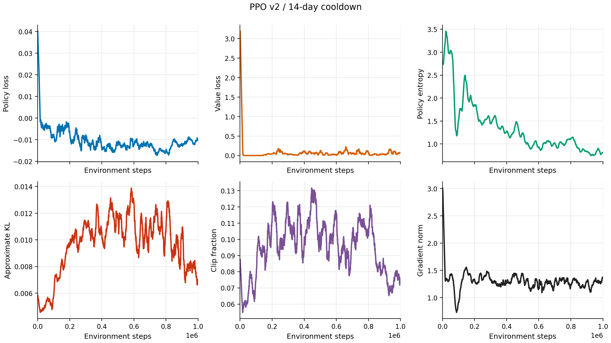

### 模型评估

| 指标 | 训练集种子 | 测试集种子 |
|---|---:|---:|
| 平均终局资产 | 119,283.65 | 124,024.20 |
| 中位数终局资产 | 126,181.64 | 118,987.15 |
| 达到 1,000,000 | 0 / 16 | 0 / 16 |
| 破产率 | 0 | 0 |

采购恢复期改变了固定采购路线的周转节奏。第二版策略开始轮换商品，但运力扩张和跨城市经营尚未形成稳定的长期策略。第二版新游戏规则游玩轨迹见[第二版 PPO（新游戏规则）游玩轨迹](ppo_v2_new_rules_trajectory.md)。

## 第三版训练方案（新游戏规则）

### 贪心教师、BC 与 DAgger

第三版使用贪心经营策略生成教师动作。教师根据当前公开行情枚举商品、产地、目的地和运输方式，计算采购、运输、销售、融资与运力扩张计划，再通过 `encode_command` 转换为统一六元组动作。

行为克隆使用教师轨迹中的 `(observation, action_mask, expert_action)` 样本训练策略分支与共享状态编码器。DAgger 让学生策略访问自身状态分布，在这些状态上重新查询教师并聚合数据，再进行 BC 更新。两轮 DAgger 的 `beta` 从 `0.50` 过渡到 `0.00`。

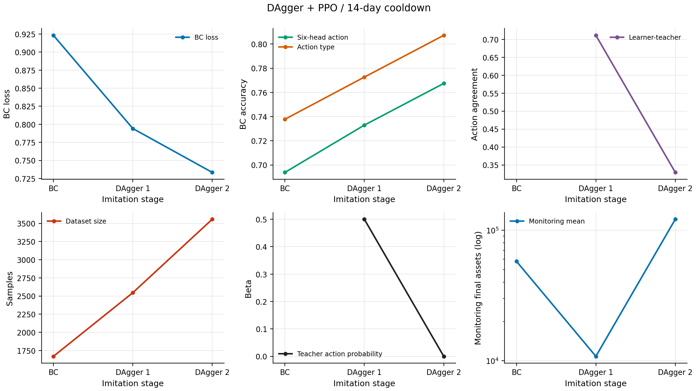

六元组动作一致率从 BC 阶段的 69.4% 提升到第一轮 DAgger 后的 73.3%，第二轮后达到 76.7%。

### PPO 微调训练监控

DAgger 完成后，Actor-Critic 继承 BC/DAgger 参数，在 `reward_v1` 下进行 8 环境并行 PPO 微调。


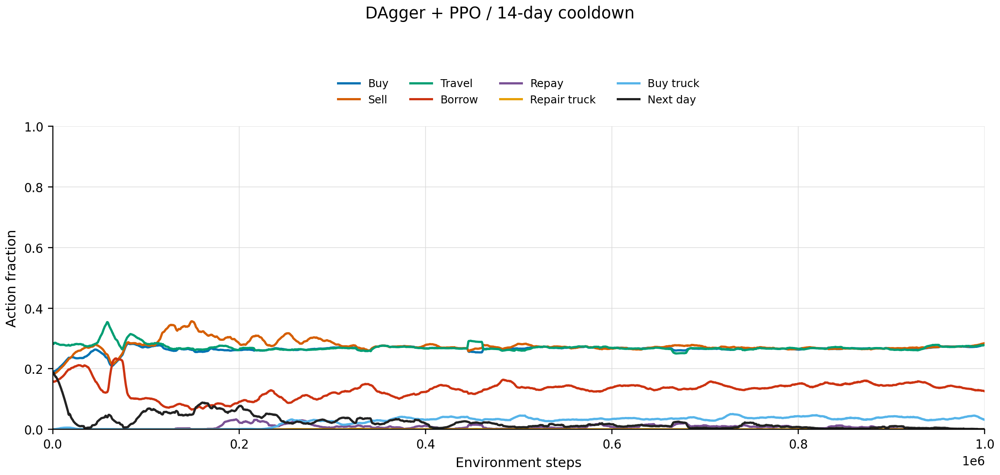

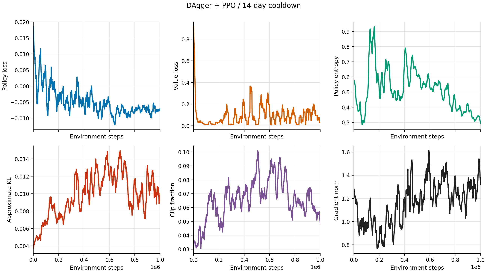

新版游戏规则下第二版与第三版的训练期评估使用同一格式对齐展示：

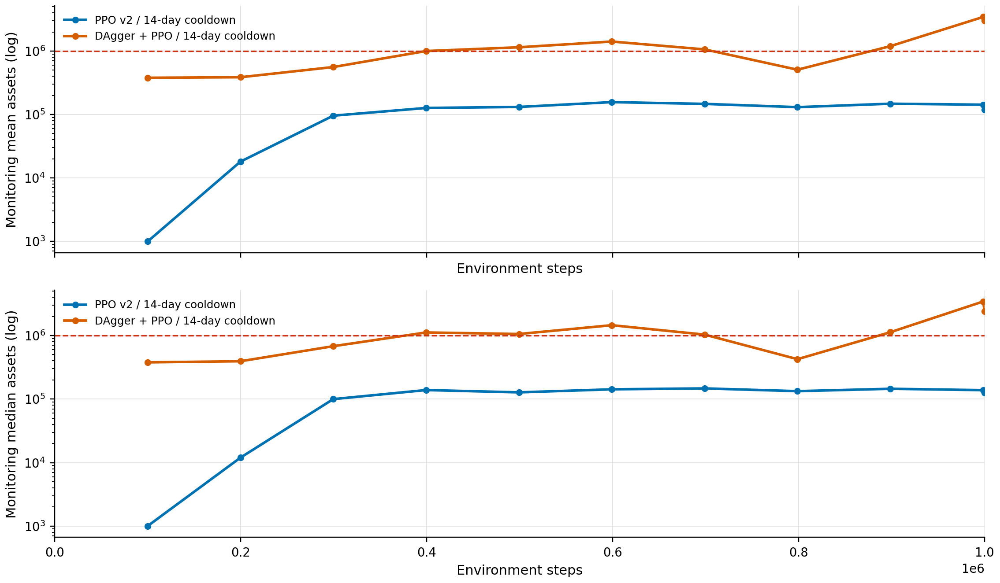

### 教师与学生模型评估

贪心教师的评估结果为：

| 评估集 | 平均终局资产 | 中位数 | 最低 | 最高 |
|---|---:|---:|---:|---:|
| 训练集种子 | 227,642.46 | 216,035.29 | 75,392.29 | 510,101.36 |
| 测试集种子 | 268,012.07 | 188,503.17 | -679.64 | 743,119.89 |

第三版 PPO 学生的最终评估为：

| 指标 | 训练集种子 | 测试集种子 |
|---|---:|---:|
| 平均终局资产 | 3,014,793.57 | 2,044,307.64 |
| 中位数终局资产 | 2,418,906.24 | 1,996,817.56 |
| 达到 1,000,000 | 16 / 16 | 16 / 16 |
| 破产率 | 0 | 0 |

第三版学生在最终评估中 16 个训练集种子和 16 个测试集种子都完成了购车。训练集种子中借款 247 次、购车 62 次、采购 586 次、出售 594 次和运输 582 次；测试集种子中对应为借款 264 次、购车 57 次、采购 594 次、出售 600 次和运输 588 次。

### 新游戏规则下的最终模型对比

| 训练方案 | 训练集种子平均终局资产 | 训练集种子中位数 | 测试集种子平均终局资产 | 测试集种子中位数 |
|---|---:|---:|---:|---:|
| 第二版 PPO | 119,283.65 | 126,181.64 | 124,024.20 | 118,987.15 |
| 第三版 DAgger + PPO | 3,014,793.57 | 2,418,906.24 | 2,044,307.64 | 1,996,817.56 |

第三版新游戏规则游玩轨迹见[第三版 DAgger + PPO 游玩轨迹](dagger_ppo_v1_trajectory.md)。

## 方案轨迹索引

| 方案 | 轨迹文件 |
|---|---|
| 第一版 PPO（原始游戏规则） | [第一版 PPO 游玩轨迹](ppo_v1_trajectory.md) |
| 第二版 PPO（原始游戏规则） | [第二版 PPO（原始游戏规则）游玩轨迹](ppo_v2_original_trajectory.md) |
| 第二版 PPO（新游戏规则） | [第二版 PPO（新游戏规则）游玩轨迹](ppo_v2_new_rules_trajectory.md) |
| 第三版 DAgger + PPO（新游戏规则） | [第三版 DAgger + PPO 游玩轨迹](dagger_ppo_v1_trajectory.md) |
